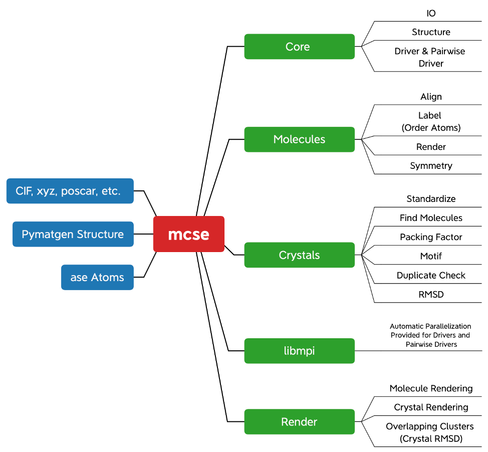

====
mcse
====

.. contents::
    :local:

    
The Molecular Crystal Simulation Environment (mcse) is an open-source Python package for manipulating and analyzing molecular crystal structures. ``mcse`` provides a practical and parallel set of tools to efficiently analyze thousands of geometries. Included is a unique ``Structure`` class for representing molecular crystals that allows users to easily and automatically obtain the molecules that make up the crystal. The molecules are found automatically by computing the covalent bonds from the periodic atomic geometry. Any typical geometry file format is accepted, through wrappers to ase_ and pymatgen_. 

.. _ase: https://wiki.fysik.dtu.dk/ase/

.. _pymatgen: https://pymatgen.org/

------------
Installation
------------

To start installing and using ``mcse``, it's highly recommended to start from an Anaconda distribution of Python, which can be downloaded for free here_. 

.. _here: https://www.anaconda.com/products/individual

Then download the library from Github. A ``zip`` file can be downloaded using the green download code button. Alternatively, this repository can be obtained using the following command. 

.. code-block:: bash
    
    $ git clone https://github.com/manny405/mcse.git

After navigating to the ``mcse`` directory, installation is completed with the following command. 

.. code-block:: bash

    $ python setup.py install

All requirements and dependencies will be installed automatically. Please be patient as this may take a while if multiple significant dependencies are missing. 

--------
Examples
--------

The *examples* folder provides an introduction to the ``mcse`` library. Included are details about the current features and analysis methods that are implemented. Geometry files are included for running every example in each respective folder. Provided is a short description of the topics that are covered:

* ``1_Introduction``: Covers the input and output (IO) of geometry files, the features of the ``mcse.Structure`` object including automatically finding molecules, and converting to and from ``ase``, ``Pymatgen``, and ``mcse``.
* ``2_Standardize``: Covers the standardization of molecules and crystal geometries. Standardization of crystals is to ensure that the covalent bonds of molecules are not split across periodic boundary conditions. Standardization of molecules places their center of mass and principal axis at the origin. 
* ``3_Analysis_Drivers``: Covers the ``Driver`` class for performing complex analysis of molecular crystals through a standardized API. Covers the ``PairwiseDriver`` class for comparing crystal geometries. All currently available analysis methods in ``mcse`` are described. Lastly, covers how analysis can be automatically parallelization ``libmpi``. 
* ``4_Visualize``: Covers rendering of images for molecules and crystals provided in ``mcse``. These capabilities automate the creation of excellent images for hundreds or thousands of geometries. 

--------
Features
--------

Currently provided is a pre-release version of ``mcse``. Given below is a visual representation of the features of the pre-release library. Each feature is covered in more detail with examples in the ``examples`` directory. 

-------
Credits
-------

I_ have been the sole developer of this library during my PhD. The use of this library by others within my research group and by external collaborators has provided a catalyst for the implementation of many features and API changes. Thank you to everyone that has used the library prior to this initial release. 

.. _I: http://ibier.io/